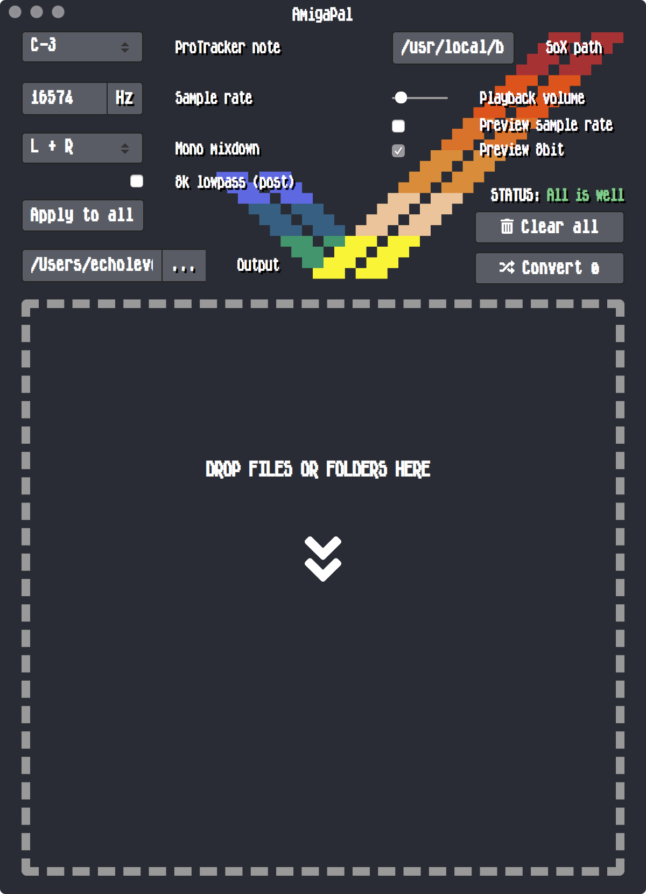

# AmigaPal

A desktop app for preparing and converting 8bit samples to use in Protracker on Amiga. Also suitable for some other trackers, perhaps certain old hardware
samplers, and similar obscure/obsolete purposes. Fundamentally a cross-platform GUI for [SoX - "the Swiss Army knife of sound processing programs"](http://sox.sourceforge.net/)
(which must be installed on your system for AmigaPal to work).

Features:
---------

* Built with Electron, so should run on MacOS, Windows and Linux
* Drag and drop files to load, or load an entire directory for batch conversion to 8svx
* Supports .wav, .mp3, .ogg, .flac, .aiff/.aif and .aac as source audio files, at any bitdepths or samplerates that SoX can handle (lots)
* .wav, .mp3, .ogg and .flac files have a waveform display and preview player for selecting time ranges to which the output will be trimmed. .aiff/aif don't display or play back, but can still be converted to 8svx as normal. If your SoX version doesn't have ogg/flac libraries installed, importing those filetypes will fail silently.
* Estimated (but fairly close) target filesize and duration are calculated on the fly, so you can trim/downsample a sample to fit within your tracker module format's size limit (128kb for Protracker .MOD, though commonly believed to be 64kb - including by some popular replayers)
* Select a target ProTracker note to automatically set the relevant samplerate
* Optional preview of how the sample(s) will sound after being downsampled and converted to 8bit - not perfect, but a close approximation! The reduction factor of the samplerate preview is determined by the 'ProTracker target note'/'Sample rate' settings.
* Lowpass and highpass filters: they can be used separately, or together as a bandpass. Previewing in AmigaPal will let you hear a very close approximation of the way it'll sound in ProTracker. NEW: now these are per-sample, rather than global as before. Also the sliders are now logarithmic, allowing for greater precision at lower frequencies. The fixed 8k post-processing lowpass filter is still global.
* Waveform display is now peak-normalised, for extra visual clarity when trimming
* Free entry field for target samplerate (AmigaPal assumes you have a familiarity with your target hardware/software so will know what's best to use here)
* Mono mixdown options for L+R mix, L channel only, R channel only. Samples which are already mono aren't affected by this.
* 'Mono mixdown type' is now also previewed in AmigaPal, so you can check for phase cancellation issues or other unexpected phenomenon.
* SoX normalises to -0.5db and applies some dithering (-S option)
* Global volume control for previewing audio (does not affect output gain/normalisation)
* Preview audio loops when adjusting trim ranges - the loop you hear is the loop you'll get in the output file
* All options are saved automatically for next time
* If you've got a big list of files but want different settings for each of them, just tweak the settings between conversions - they all take immediate effect on any subsequent conversions
* As of v0.0.6-beta6, all sample rate, mixdown and post-LP settings are available per-sample, while the 'Apply to all' button can be used to apply global settings, overriding any per-sample customisation
* The 'Convert All' button does exactly what you think it does. Be sure that's what you want before clicking it with a huge folder of samples loaded up...
* There are now some keyboard shortcuts: clicking a sample will highlight it, then spacebar will toggle that sample's playback (restarting from the beginning each time, whereas the play/pause button continues from where you left off). Up/Down arrows change which sample is highlighted. Esc stops all sample playback globally. Enter/Return converts the currently selected sample. Backspace removes the currently selected sample from AmigaPal (does not delete the original file). L (left), R (right) and B (both) sets the current sample's mono mixdown type.
* 1st April: Dramatically reduced memory footprint and CPU load when large numbers of samples are loaded for batch conversion. This was achieved by fixing the packaged build's ability to stream files from disk as HTML5 audio player objects, rather than their being read into buffers in memory; zapping cached waveform display data after drawing it on the canvas (waveform displays have their own canvases, overlaid by translucent filter displays, so never need to be redrawn); and reverting Sample Rate/8bit preview effects to the global chain rather than per-sample. This means that when 'Sample rate preview' is enabled, sample playback is now monotimbral (only one sample can play at a time) - clicking on another sample while one sample is playing will stop playback and begin playback of the newly selected sample. If the new sample's target PT note is different, this will be reflected in the Sample rate preview effect. If 'Sample rate preview' is disabled, multiple samples can be played simultaneously as before. 8bit preview is independent of all this - it's either globally on or off, and doesn't affect playback timbrality/polyphony.
* Trim range is now draggable, so you can set a target PT note and then choose a range limit for your desired maximum output filesize, if you have one - often 64kb or 128kb. Then drag that fixed range around until you get a window of audio data that you're happy with. Protracker can't load samples starting at a given byte/duration offset, so trimming like this is handy for getting the longest sample possible into Protracker without it cutting off something important at the end of the file. Nb: PT samples aren't really restricted to 64kb, it's just that the replayers (and most trackers) have always had nasty bugs which cause problems, e.g. when a sample's loop point/s exists beyond that 64kb boundary. It can handle 128kb fine, and 8bitbubsy has fixed all >64kb bugs in PT2.3E (for 68k Amiga) and his PT2.3D clone for modern platforms. Not all replayers are fixed...but if you want to live dangerously, or only intend for your stuff to be heard in fixed PT/replayer versions, or just don't care, then you have my permission to go absolutely bananas with your fancy 128kb samples.
* You can now choose a custom output directory which will be stored persistently in AmigaPal’s options. To clear it from your saved options, and revert to the default behaviour of output samples being saved in the same directory as input samples, just clear the text box.
* UI overhaul. Oldschool Amiga font (MicroKnight) added, because I like it. Top options now stay fixed while sample list scrolls, and some colours have been tweaked to sit better with the logo. App's top bar is skinned (on MacOS, at least - not sure how it'll look on Windows until I get a chance to test it). Top bar/title area is draggable so the window can be moved around.

Changelog:
----------
**6th May 2020 -**
* Whoops, the fontawesome icons have been broken for months - fixed
* Now there's a 'Load...' button for loading single or multiple files via your operating system's file dialogue, and it caches the enclosing directory of the most recently loaded file for future use. If that directory becomes unavailable, it'll fall back to AmigaPal's root directory.
* There's now a confirmation popup on 'Clear All' in case you didn't, in fact, want to clear all.
* And one on 'Apply to all', because that's also a good way to ruin lots of hard work.
* 'Truncate Filenames' option: this strips out special characters and spaces, trims the output filename to a limit, and prefixes with a numerical ID that's just the file's position in the AmigaPal file list (to keep files unique if the truncation removes their original numbering system). Filenames under the Amiga filesystem are usually limited to 31 characters, though some trackers might struggle with even much shorter filenames - not to mention enormous full path lengths from nested long drawer names. I've decided to default to 3 (prefix) + 8 (name) + 5 (extension) = 16. Let me know if that's too restrictive or doesn't solve your problem. I also capitalise them because, I dunno, I think it looks cool. But it's also sometimes good for visually distinguishing converted files if your target dir is the same as the source dir.
* Output directory can be opened in Explorer/Finder/etc, for added convenience.
* Fixed a bug where the pause button wouldn't switch back to a play button after a sample's playback had ended.

**5th May 2020 -**
* Finally got an Electron dev environment up and running on Windows 10
* Updated some dependencies and did a bit of browser security futureproofing (there is basically no security, by the way - you use AmigaPal at your own risk, running locally and with local media files, but in order to achieve this it's got all the safeties turned off)
* I've hopefully made AmigaPal platform agnostic, at last. As usual I haven't been able/willing to test on Linux, but slash direction when parsing/rewriting paths and some other quirks have been accounted for.
* Minor UI tweaks, including the ability to adjust AmigaPal's height. (Width is still locked, otherwise things go crazy.)

Known Bugs / To Do:
----------

* It would be nice to be able to layer/mix samples in AmigaPal. You can do it in ProTracker, of course, but mixing at higher sample rates/bit depths might give better results in the end. We'd need to be able to select multiple samples, and also decide on an output filename template. Low priority for now!

* I wish I could get the app Icon working properly. There IS one, I just can't get Electron-Forge
to add it when packaging.

Would like to have, but probably won't happen:
-----------------------------------------------

* Previewing target pitch or Protracker note in the app - this should be mega easy, because playing back a sample at arbitrary rates in order to speed it up or slow it down while commensurately changing its pitch is as old as...well, the Amiga. And the Fairlight. And older than that. But Chrome's WebAudio implementation actively ignores this time-honoured use case when playing media elements (which is what AmigaPal uses so that it can do other fancy things without incurring a massive performance hit). So this will probably never happen, which is a shame, but that's the reason.

Installation
------------

**MacOS/Linux**

As long as you've got SoX installed, and can find the path to the sox binary, you should be all set. The default path is /usr/local/bin.

**Windows**

This is a bit more involved:
* Don't put AmigaPal in Program Files or Program Files (x86)
* Copy sox.exe into the same directory as AmigaPal
* Enter ".\\" as the sox path
* Leave the output directory blank (by default AmigaPal will place converted files in the same directory as the source files)

I'll fix this when I get a chance - it seems my dir path code isn't as OS-agnostic as I thought it was. Many thanks to comatron (http://comatron.de) for figuring out this temporary solution and letting me know!

CLI
---

If you'd prefer to script the conversion process, or would just rather not use the Electron GUI, here's a guide to the SoX settings that AmigaPal uses:

`sox [infilename].wav [outfilename].8svx trim [starttime] [duration] norm 0.5 remix - highpass -1 [frequency in hz] lowpass -1 [frequency in hz] rate [sample rate] lowpass -1 8000 norm 0.5 dither -S`

The second lowpass filter is optional, being processed after the sample rate reduction in the event that some unwanted hiss needs to be removed. The conversion to 8bit is implicit in the 8SVX filetype, which is an explicitly 8bit format.

Values in square brackets are mapped to AmigaPal's controls. Here's an example for converting a 16bit stereo WAV to an 8bit 8SVX sample trimmed to 2.3 seconds starting at 0.2 seconds, normalised, highpassed (low cut) at 60hz, lowpassed (high cut) at 10000, reduced to the sample rate of ProTracker's note 'A-3' (~27928hz), lowpassed again at 8k to remove hiss, normalised again, then finally dithered:

`sox inputfile.wav outfile.8svx trim 0.2 2.3 norm 0.5 remix - highpass -1 60 lowpass -1 10000 rate 27928 lowpass -1 8000 norm 0.5 dither -S`

AmigaPal is doing nothing special that you can't do with this SoX syntax, but it makes batch-converting stuff a lot easier and removes some guesswork! You might find it's worth playing with the order in which SoX processes the effects (with some caveats, of which SoX's terse and only occasionally helpful error messages will inform you), but this is what works best for me.

Building (development only)
---------------------------

You'll need to have bower and npm installed.

Clone the repo:

`
https://github.com/echolevel/AmigaPal.git
`

Install all the dependencies:

`
cd AmigaPal && npm install  && bower install
`

Run:

`
electron-forge start
`

Package (optional - see [electron-packager](https://github.com/electron-userland/electron-packager) documentation for more on platform and arch options):

`
electron-forge package --platform=darwin,win32 --arch=x64
`

Publish (optional, and you'll need to use your own GitHub credentials in package.json - my access token is set locally as an environment variable):

`
electron-forge publish
`

Note that electron-forge's publish can only package a distributable for the architecture/platform you're building on. I'm on Mac, so for AmigaPal's Windows zip in the Releases section, I've just zipped and uploaded the package created with 'electron-forge package --platform=darwin,win32 --arch=x64'. This may or may not be wise ¯\\__(ツ)__/¯

More Info
---------

"Why is it called AmigaPal?" - I made this for myself, to speed up converting audio samples into the format
I generally use in ProTracker on the Amiga. They need to be mono, 8bit, and it's useful if they conform to the samplerates ProTracker uses for musical notes.
By default AmigaPal converts to 27928hz (A-3), which produces a relatively high quality 8bit 8svx file. So it's a helper tool (hence pal), plus I grew up
using PAL-region Amigas (hence pal), plus I like the redundancy of Amiga (friend) and Pal (friend). Also it currently defaults to using PAL samplerates for
ProTracker notes...I may add in NTSC as an alternative if there's any demand. AmigaPal is essentially a front-end for a SoX command that I baked with the help
of h0ffman, kebby and some of my own trial-and-error testing. The dream would be to replicate the lowpass filter 8bitbubsy has implemented in his MacOS/PC port
of ProTracker and use it as post-bit reduction processing to reduce some dithering noise, but I haven't been able to match it so far. Right now, AmigaPal gives the
best quality I've been able to achieve within ProTracker's limitations, according to my tastes - your mileage may vary!
