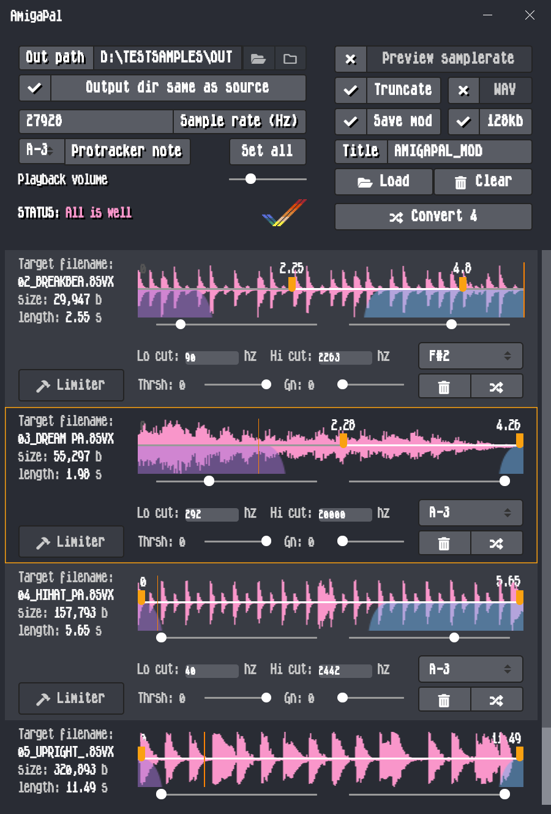

# AmigaPal

A desktop app for preparing and converting 8bit samples to use in Protracker on Amiga. Also suitable for some other trackers, perhaps certain old hardware
samplers, and similar obscure/obsolete purposes. Fundamentally a cross-platform GUI for [SoX - "the Swiss Army knife of sound processing programs"](http://sox.sourceforge.net/)
(which must be installed on your system for AmigaPal to work).

Features:
---------

* Built with Electron, so should run on MacOS, Windows and Linux
* Drag and drop files to load, or load an entire directory for batch conversion to 8svx
* Supports .wav, .mp3, .aiff/.aif and .raw as source audio files, at any bitdepths or samplerates that SoX can handle (lots)
* .wav and .mp3 files have a waveform display and preview player for selecting time ranges to which the output will be trimmed
* Estimated (but fairly close) target filesize and duration are calculated on the fly, so you can trim/downsample a sample to fit within your tracker module format's size limit (128kb for Protracker .MOD, though commonly believed to be 64kb - including by some popular replayers)
* Select a target ProTracker note to automatically set the relevant samplerate
* Optional preview of how the sample(s) will sound after being downsampled and converted to 8bit - not perfect, but a close approximation! The reduction factor of the samplerate preview is determined by the 'ProTracker target note'/'Sample rate' settings.
* Lowpass and highpass filters: they can be used separately, or together as a bandpass. Previewing in AmigaPal will let you hear a very close approximation of the way it'll sound in ProTracker. NEW: now these are per-sample, rather than global as before. Also the sliders are now logarithmic, allowing for greater precision at lower frequencies. The fixed 8k post-processing lowpass filter is still global.
* Free entry field for target samplerate (AmigaPal assumes you have a familiarity with your target hardware/software so will know what's best to use here)
* Mono mixdown options for L+R mix, L channel only, R channel only; or disable Mono to retain the source audio's channel configuration.
* 'Mono mixdown type' is now also previewed in AmigaPal, so you can check for phase cancellation issues or other unexpected phenomenon.
* SoX normalises to -0.5db and applies some dithering (-S option)
* Global volume control for previewing audio (does not affect output gain/normalisation)
* Preview audio loops when adjusting trim ranges - the loop you hear is the loop you'll get in the output file
* All options are saved automatically for next time
* If you've got a big list of files but want different settings for each of them, just tweak the settings between conversions - they all take immediate effect on any subsequent conversions
* The 'Convert All' button does exactly what you think it does. Be sure that's what you want before clicking it with a huge folder of samples loaded up...
* There are now some keyboard shortcuts: clicking a sample will highlight it, then spacebar will toggle that sample's playback (restarting from the beginning each time, whereas the play/pause button continues from where you left off). Up/Down arrows change which sample is highlighted. Esc stops all sample playback globally.

Known Bugs:
----------

* The pause icon appears upon sample load before playback has started. After clicking, play/pause behave as expected. This is due to a combination of Angular 2's weird ng-class conditions and HTML5 Audio's convoluted playback state reporting. I'll figure it out eventually.

Installation
------------

As long as you've got SoX installed, and can find the path to the sox binary, you should be all set. The default path is /usr/local/bin.

soxi is also used to gather initial source file info, calculate target size/duration, and draw the waveform; it *should* be in the same directory as sox got installed to.

CLI
---

If you'd prefer to script the conversion process, or would just rather not use the Electron GUI, here's a guide to the SoX settings that AmigaPal uses:

`sox [infilename].wav [outfilename].8svx trim [starttime] [duration] norm 0.5 remix - highpass -1 [frequency in hz] lowpass -1 [frequency in hz] rate [sample rate] lowpass -1 8000 norm 0.5 dither -S`

The second lowpass filter is optional, being processed after the sample rate reduction in the event that some unwanted hiss needs to be removed. The conversion to 8bit is implicit in the 8SVX filetype, which is an explicitly 8bit format.

Values in square brackets are mapped to AmigaPal's controls. Here's an example for converting a 16bit stereo WAV to an 8bit 8SVX sample trimmed to 2.3 seconds starting at 0.2 seconds, normalised, highpassed (low cut) at 60hz, lowpassed (high cut) at 10000, reduced to the sample rate of ProTracker's note 'A-3' (~27928hz), lowpassed again at 8k to remove hiss, normalised again, then finally dithered:

`sox inputfile.wav outfile.8svx trim 0.2 2.3 norm 0.5 remix - highpass -1 60 lowpass -1 10000 rate 27928 lowpass -1 8000 norm 0.5 dither -S`

AmigaPal is doing nothing special that you can't do with this SoX syntax, but it makes batch-converting stuff a lot easier and removes some guesswork! You might find it's worth playing with the order in which SoX processes the effects (with some caveats, of which SoX's terse and only occasionally helpful error messages will inform you), but this is what works best for me.

Building (development only)
---------------------------

You'll need to have bower and npm installed.

Clone the repo:

`
https://github.com/echolevel/AmigaPal.git
`

Install all the dependencies:

`
cd AmigaPal && npm install  && bower install
`

Run:

`
electron-forge start
`

Package (optional - see [electron-packager](https://github.com/electron-userland/electron-packager) documentation for more on platform and arch options):

`
electron-forge package --platform=darwin,win32 --arch=x64
`

Publish (optional, and you'll need to use your own GitHub credentials in package.json - my access token is set locally as an environment variable):

`
electron-forge publish
`

Note that electron-forge's publish can only package a distributable for the architecture/platform you're building on. I'm on Mac, so for AmigaPal's Windows zip in the Releases section, I've just zipped and uploaded the package created with 'electron-forge package --platform=darwin,win32 --arch=x64'. This may or may not be wise ¯\\__(ツ)__/¯

More Info
---------

"Why is it called AmigaPal?" - I made this for myself, to speed up converting audio samples into the format
I generally use in ProTracker on the Amiga. They need to be mono, 8bit, and it's useful if they conform to the samplerates ProTracker uses for musical notes.
By default AmigaPal converts to 27928hz (A-3), which produces a relatively high quality 8bit 8svx file. So it's a helper tool (hence pal), plus I grew up
using PAL-region Amigas (hence pal), plus I like the redundancy of Amiga (friend) and Pal (friend). Also it currently defaults to using PAL samplerates for
ProTracker notes...I may add in NTSC as an alternative if there's any demand. AmigaPal is essentially a front-end for a SoX command that I baked with the help
of h0ffman, kebby and some of my own trial-and-error testing. The dream would be to replicate the lowpass filter 8bitbubsy has implemented in his MacOS/PC port
of ProTracker and use it as post-bit reduction processing to reduce some dithering noise, but I haven't been able to match it so far. Right now, AmigaPal gives the
best quality I've been able to achieve within ProTracker's limitations, according to my tastes - your mileage may vary!
